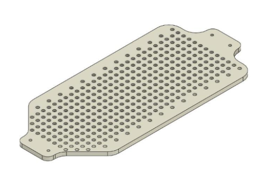
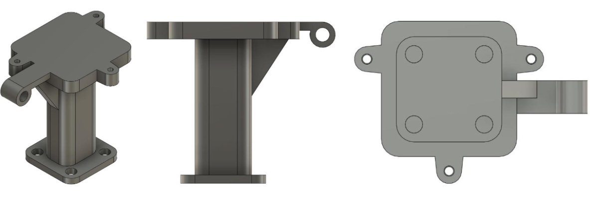
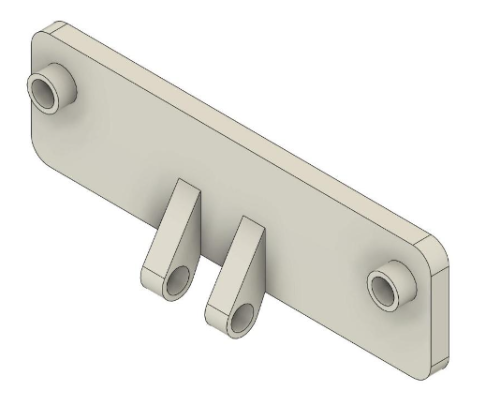
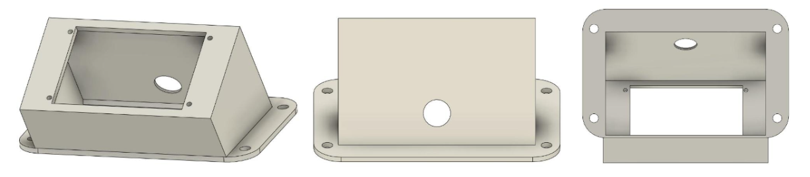

<!-- PROJECT LOGO -->
 

  
<h3>ECE/MAE148 Final Project</h3>

Team 7 Fall 2024

<h2><b>Table of Contents</b></h2>
<ul>
  <li><a href="#team-members">Team Members</a></li>
  <li><a href="#final-project">Final Project</a></li>
  <li><a href="#original-goals">Original Goals</a></li>
  <li><a href="#goals-we-met">Goals We Met</a></li>
  <li><a href="#our-hopes-and-dreams">Our Hopes and Dreams</a></li>
  <li><a href="#stretch-goals">Stretch Goals</a></li>
  <li><a href="#final-project-videos">Final Project Videos</a></li>
  <li><a href="#cad-parts">CAD Parts</a></li>
  <li><a href="#final-assembly">Final Assembly</a></li>
  <li><a href="#">Hardware</a></li>
  <li><a href="#software-design">Software Design</a></li>
  <li><a href="#gantt-chart">Gantt Chart</a></li>
  <li><a href="#course-deliverables">Course Deliverables</a></li>
  <li><a href="#acknowledgments">Acknowledgments</a></li>
  <li><a href="#contact">Contact</a></li>
</ul>

## Team Members

Jeff - Aerospace Engineering
Chris - Mechanical Engineering
Ashlee - Electrical Engineering

## Final Project

This project utilizes the DepthAI Toolbox in the robocar framework to identify a person and follow them until an ArUco marker is shown. If a valid marker is shown, a green light is flashed on the LCD screen and the car will back up to identify another person. If an invalid marker is shown, a red light is flashed on the LCD screen and the car will continue to follow the person until a valid marker is detected.

---

### Original Goals

The original goal for this project was to have a car that patrols an area using a predetermined path and upon detecting a human, follow them until a valid ID is shown.

---

### Goals We Met

1. **ArUco Marker Detection**  
   Using an OAKD-Lite Camera and the DepthAI Toolbox, we successfully detected ArUco markers from the `aruco.DICT_4X4_50` dictionary. An Arduino-controlled LCD screen indicates the detection status:

   - **Blue:** Waiting for detection.
   - **Green:** Valid marker detected.
   - **Red:** Invalid marker detected.

2. **Person Detection**  
   Using the DepthAI Toolbox, the system detects people up to 6 meters away. When a person is detected, the car follows them by dynamically adjusting its speed and steering. This detection capability integrates real-time depth data and RGB video streaming.

3. **Dynamic Response to Markers**  
   Once an accepted ArUco marker is detected:
   - The car halts, flashes a green light on the LCD screen, and backs up.
   - It then resumes patrolling, searching for another human to follow.  
     If no marker is detected, the car continues its tracking behavior.

---

### Our Hopes and Dreams

---

### Stretch Goals

- **GPS Integration**  
  Enabling the car to follow a predefined route with waypoint precision.
- **Enhanced Object Avoidance**  
  Using an additional camera or LiDAR for safer navigation in environments with dynamic obstacles.

---

## Final Project Videos

### CAD Parts

**Main Mounting Plate**

**Combined Camera and LIDAR Mount**

**Camera Mount**

**LCD Mount**

---

### Final Assembly

---

### Hardware

---

### Software Design

#### ROS2 Nodes

The project leverages ROS2 with a custom node called `CameraControlNode` to handle:

1. **Person Detection:**  
   Uses DepthAI's spatial neural network to detect people and estimate their 3D position.
2. **Navigation:**  
   Dynamically adjusts speed and direction to track the detected person.
3. **ArUco Marker Recognition:**  
   Detects and processes ArUco markers to determine the next course of action.

#### DepthAI Pipeline

The DepthAI pipeline enables real-time computer vision by combining:

- **Color Camera:** Captures high-resolution images for visualization and object detection.
- **Mono Cameras:** Generate stereo depth perception using grayscale images.
- **Stereo Depth Module:** Computes depth maps and provides 3D coordinates of detected objects.
- **MobileNet-SSD Neural Network:** Processes RGB frames for object detection and spatial localization.
- **Output Queues:** Streams processed data to the host application.

#### ROS2 Topics

- `/person_detection`: Publishes detected person data, including their spatial position.
- `/aruco_markers`: Shares information about detected ArUco markers.
- `/cmd_vel`: Issues velocity commands for dynamic navigation.

#### Arduino Communication

The Arduino facilitates communication via serial commands:

- `"yes"`: Valid marker detected.
- `"no"`: Invalid marker detected.
- `"waiting"`: No marker detected.

---

### Gantt Chart

---

### Course Deliverables

---

### Acknowledgements

Special thanks to Professor Jack Silberman, Winston, and Alexander for an amazing Fall 2024 Class.

---

### Contact
